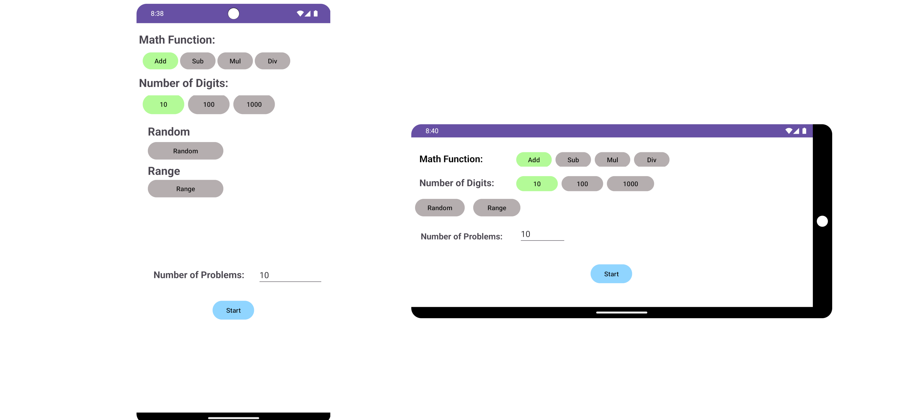

# math-lesson

Math Lesson is an app to aid your child in attaining competence in basic math. Math Lesson allow the parent/whomever to manage the configuration of the target Lessons, based upon the level of understanding. It concentrates on basic addition, subtraction, multiplication and division. For more detailed configuration definition see <documentation> below.  This app is intended for children learning simple math i.e. first through fourth or fifth grades.

Below Find the High Level Design (HLD) of the Math Lesson, depicting the interactions of the various components.


## Table of Contents
- [sarah-math](#sarah-math)
  * [Table of Contents](#table-of-contents)
  * [Development](#development)
    + [Building Math Lesson](#building-sarah-math)
    + [Testing](#testing-sarah-math)
  + [Configuration](#configuration)
  * [Documentation](#documentation)
    + [Open Source References](#open-source-references)
    + [Architecture](#architecture)
  * [Contributing](#contributing)
  * [Contributors](#conributors)

## Development

The Math Lesson was developed in a Linux environment using the Java Language and the Android Studio <version> build environment. 

### Building Math Lesson

#### To build and upload to your connected bench, (in docker, in service directory)

```agsl
gradle clean
gradle build
```

### Testing Math Lesson

Math Lesson is tested in a

## Configuration


## Documentation

Math Lesson documentation is maintained in this document.



### Open Source References
[//]: # ([Optional] Add any used open source projects, software or repositories here)

OPTIONAL: Add any used open source projects, software or repositories here

### Architecture


## Contributing

1. `Clone` repository to your machine
1. Create your feature branch (`git checkout -b my-new-feature`)
1. Commit your changes (`git commit -am 'Add some feature'`)
1. Push to the branch (`git push origin my-new-feature`)
1. Create a new Merge Request

## Contributors[Francis Burns]: - Developer, Maintainer

<br><br>
- [Frank Burns]:              - README Content

 <a href="#top">Back to Top</a>