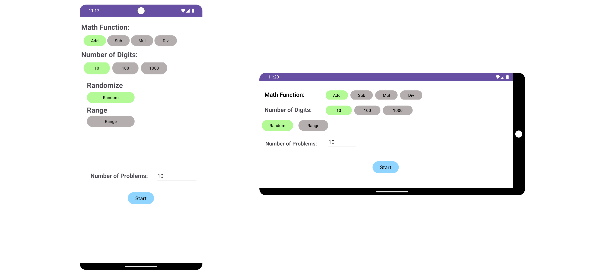
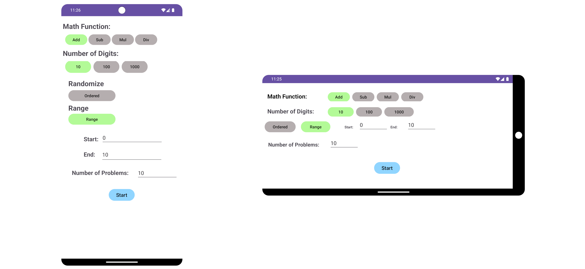
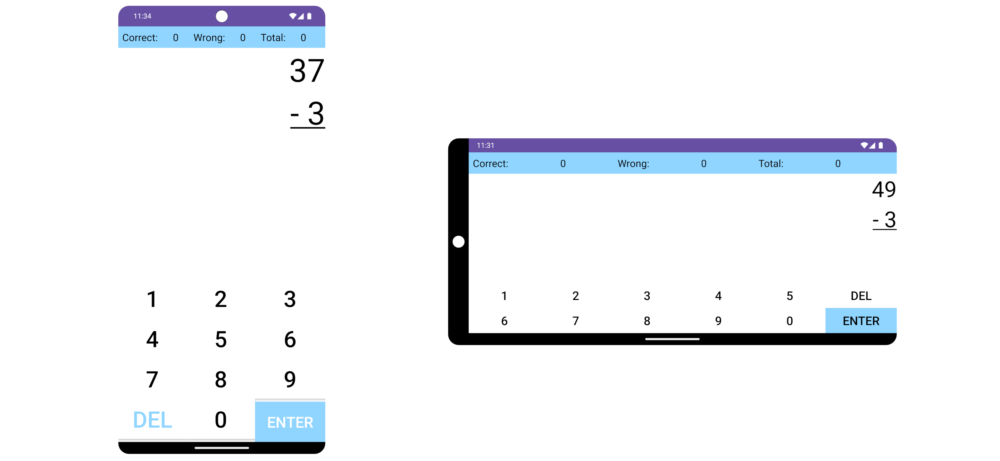
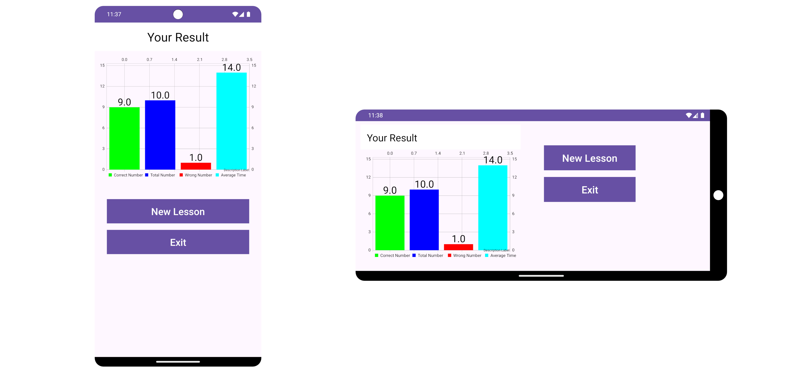

# math-lesson

Math Lesson is an app to aid your child in attaining competence in basic math. Math Lesson allow the parent/whomever to manage the configuration of the target Lessons, based upon the level of understanding. It concentrates on basic addition, subtraction, multiplication and division. For more detailed configuration definition see <documentation> below.  This app is intended for children learning simple math i.e. first through fourth or fifth grades.

The application consists of a configuration screen, a problem solving screen and a results screen.  The configuration screen allows the parent to select

1. Math Function (Addition, Subtraction, Multiplication and Division)
1. Digit Level (1-10, 1-100, 1-1000)
1. Random or ordered
1. Range
   1. Start Range
   1. End Range
1. Number of problems for the lesson

The execution screen iterates through the configured problem set and tests the student. The Result screen displays a chart with:

1. Correct Number of Answers
1. Total Number of Problems
1. Incorrect Number of Answers
1. Average time spent during the lesson

Below Find the High Level Design (HLD) of the Math Lesson, depicting the interactions of the various components.


## Table of Contents
- [math-lesson](#math-lesson)
  * [Table of Contents](#table-of-contents)
  * [Development](#development)
    + [Building Math Lesson](#building-sarah-math)
    + [Testing](#testing-sarah-math)
  * [Documentation](#documentation)
    + [Open Source References](#open-source-references)
    + [Architecture](#architecture)
  * [Contributing](#contributing)

## Development

The Math Lesson was developed in a Linux environment using the Java Language and the Android Studio <version> build environment. The code is located in GitHub at: https://github.com/frankaburns/mathLesson

### Building Math Lesson

Download Android Studio and open the mathLesson project.  Click the build button.

#### To build with gradle

```agsl
cd <mathLesson directory>
gradle clean
gradle build
```

### Testing Math Lesson

Math Lesson has Unit tests that validate the domain functionality.  Integration testing is done following the test plan located <>

## Documentation

Math Lesson documentation is maintained in this document.

### Configuration View

The configuration view is shown below with the add function, 1 digit (10),the random button and number of problems set to 10 are selected,  Click the Start button to create the configured problem set.

Below is an image of the above described configuration in Portrait and Landscape.



The configuration view is shown below with the add function, 1 digit (10),the Ordered button (Random deselected) and number of problems set to 10 are selected,  Additionally the Start and End ranges are set.  Click the Start button to create the configured problem set.

Below is an image of the above described configuration in Portrait and Landscape.



### Lesson View

The Lesson view is shown below with the add function, 1 digit (10),the Ordered button (Random deselected) and number of problems set to 10 are selected,  Additionally the Start and End ranges are set.  Click the Start button to create the configured problem set.

Below is an image of the above configured lesson view in Portrait and Landscape.



### Results View

The Result view displays the lesson statistics including number correct, total, incorrect and the average time for each problem.

Below is an image of the above described configuration in Portrait and Landscape.



### Open Source References
[//]: # ([Optional] Add any used open source projects, software or repositories here)

OPTIONAL: Add any used open source projects, software or repositories here

### Architecture


## Contributing

1. `Clone` repository to your machine
1. Create your feature branch (`git checkout -b my-new-feature`)
1. Commit your changes (`git commit -am 'Add some feature'`)
1. Push to the branch (`git push origin my-new-feature`)
1. Create a new Merge Request

## Contributors[Francis Burns]: - Developer, Maintainer

<br><br>
- [Frank Burns]:              - README Content

 <a href="#top">Back to Top</a>