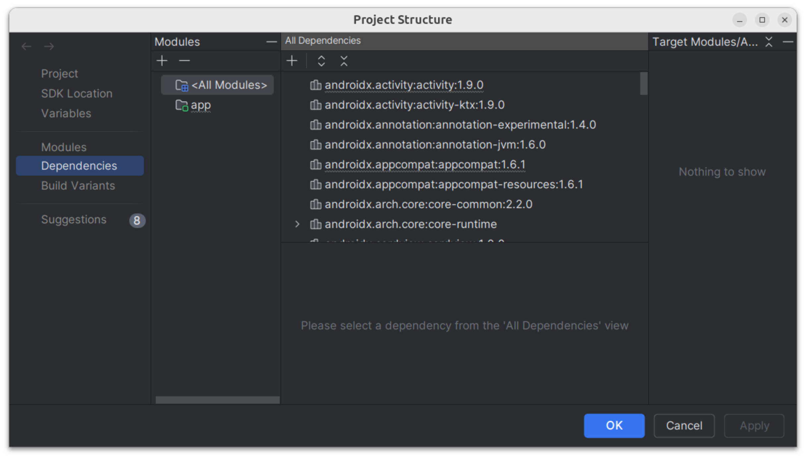
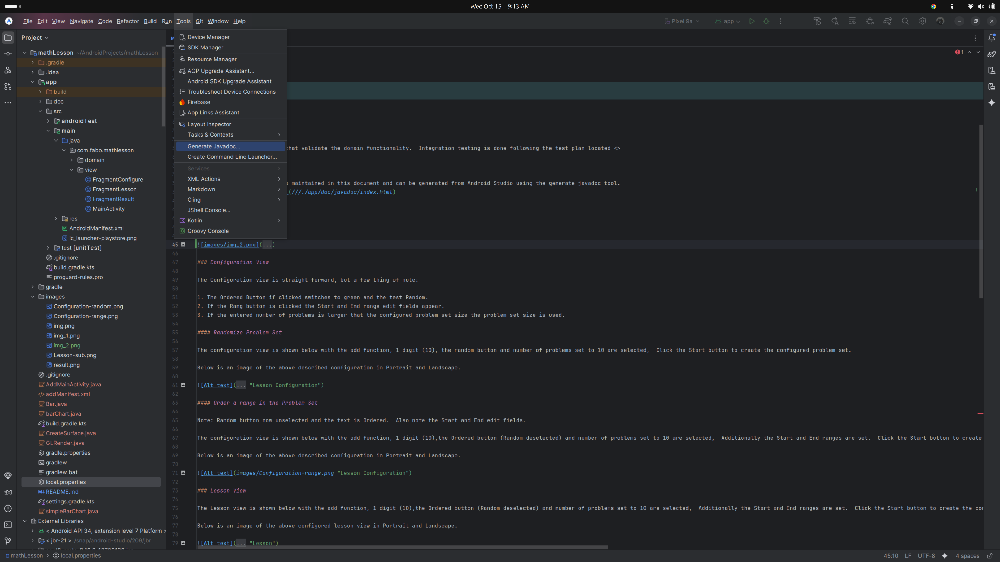
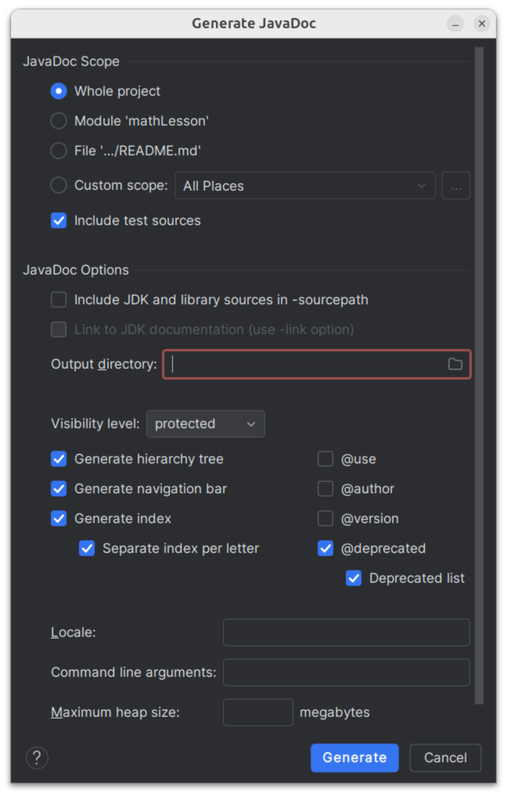
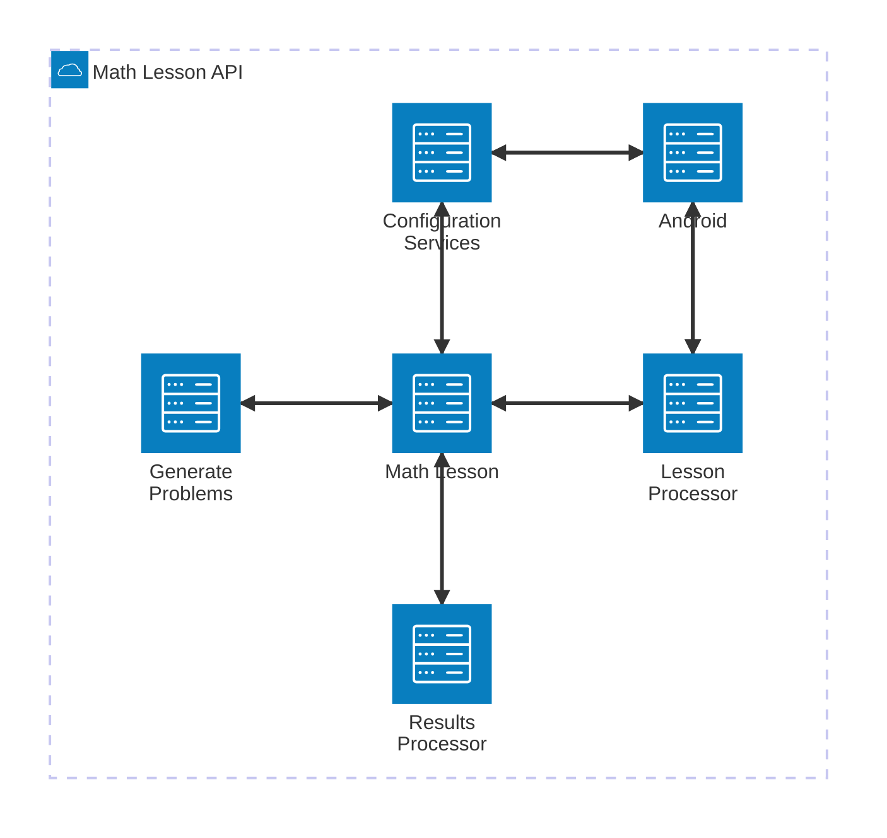

# math-lesson

Math Lesson is an app to aid your child in attaining competence in basic math. Math Lesson allow the parent/whomever to manage the configuration of the target Lessons, based upon the level of understanding. It concentrates on basic addition, subtraction, multiplication and division. For more detailed configuration definition see <documentation> below.  This app is intended for children learning simple math i.e. first through fourth or fifth grades.

## Table of Contents
- [math-lesson](#math-lesson)
  * [Table of Contents](#table-of-contents)
  * [Development](#development)
    + [Building Math Lesson](#building-math-lesson)
    + [Testing](#testing-math-lesson)
  * [Documentation](#documentation)
    + [Open Source References](#open-source-references)
    + [Architecture](#architecture)
  * [Contributing](#contributing)

## Development

The Math Lesson was developed in a Linux environment using the Java Language and the Android Studio <version> build environment. The code is located in GitHub at: https://github.com/frankaburns/mathLesson

### Building Math Lesson

Download Android Studio and open the mathLesson project.  Click the build button.

#### To build with gradle

```agsl
cd <mathLesson directory>
gradle clean
gradle build
```

### Testing Math Lesson

Math Lesson has Unit tests that validate the domain functionality.  Integration testing is done following the test plan located <>

## Documentation

Math Lesson documentation is maintained in this document and can be generated from Android Studio using the generate javadoc tool.
The javadoc files are [here](///./app/doc/javadoc/index.html)

The Project Structure requires updated to include the local copy of 'android.jar'. To accomplish this, first locate your locate copy of android.jar, usually /home/,user./Android/Sdk/platforms/,version./android.jar.
Select File>Project Structure>dependencies>All Modules. The screen below will pop up.



Right click on <All Modiles> and select New Module and the screen below will pop up.


Enter the desired output directory in the field and click OK.
Then select Tools>Generate Javadoc...



Select generate.




### Configuration View

The Configuration view is straight forward, but a few thing of note:

1. The Ordered Button if clicked switches to green and the test Random.
2. If the Rang button is clicked the Start and End range edit fields appear.
3. If the entered number of problems is larger that the configured problem set size the problem set size is used.

#### Randomize Problem Set

The configuration view is shown below with the add function, 1 digit (10), the random button and number of problems set to 10 are selected,  Click the Start button to create the configured problem set.

Below is an image of the above described configuration in Portrait and Landscape.


#### Order a range in the Problem Set

Note: Random button now unselected and the text is Ordered.  Also note the Start and End edit fields.

The configuration view is shown below with the add function, 1 digit (10),the Ordered button (Random deselected) and number of problems set to 10 are selected,  Additionally the Start and End ranges are set.  Click the Start button to create the configured problem set.

Below is an image of the above described configuration in Portrait and Landscape.


### Lesson View

The Lesson view is shown below with the add function, 1 digit (10),the Ordered button (Random deselected) and number of problems set to 10 are selected,  Additionally the Start and End ranges are set.  Click the Start button to create the configured problem set.

Below is an image of the above configured lesson view in Portrait and Landscape.


### Results View

The Result view displays the lesson statistics including number correct, total, incorrect and the average time for each problem.

Below is an image of the above described configuration in Portrait and Landscape.


### Open Source References
[//]: # ([Optional] Add any used open source projects, software or repositories here)

1. The Charting software employed, use MPAndroid Chart, on the Results View   - com.github.PhilJay:MPAndroidChart

### Architecture

The application consists of a configuration screen, a problem solving screen and a results screen.  The configuration screen allows the parent to select

1. Math Function (Addition, Subtraction, Multiplication and Division)
2. Digit Level (1-10, 1-100, 1-1000)
3. Random or ordered
4. Range 
   1. Start Range
   2. End Range
5. Number of problems for the lesson

The execution screen iterates through the configured problem set and tests the student. The Result screen displays a chart with:

1. Correct Number of Answers
2. Total Number of Problems
3. Incorrect Number of Answers
4. Average time spent during the lesson

Below Find the High Level Design (HLD) of the Math Lesson, depicting the interactions of the various components.





## Contributing

1. `Clone` repository to your machine 
2. Create your feature branch (`git checkout -b my-new-feature`)
3. Commit your changes (`git commit -am 'Add some feature'`)
4. Push to the branch (`git push origin my-new-feature`)
5. Create a new Merge Request

## Contributors

- [Francis Burns]:            - Developer, Maintainer
- [Francis Burns]:            - README Content

 <a href="#top">Back to Top</a>